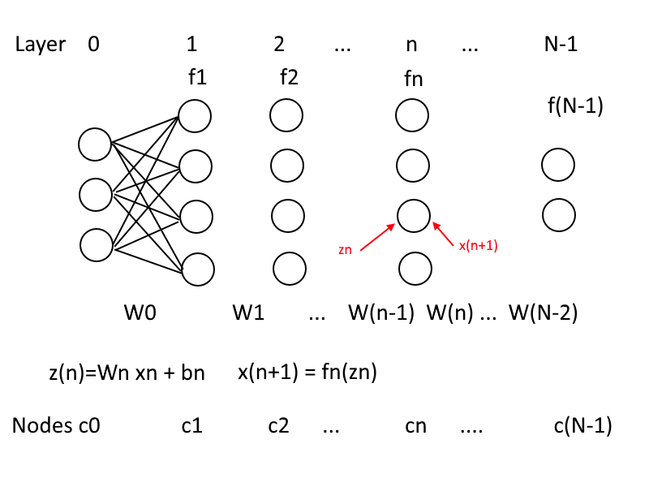

# Neural Net Notes
Chris Lomont Dec 2018

## Notation

\\(N\\) **layers** \\(n=0,1,\dots,N-1\\), with layer \\(n\\) having \\(C_n\\) nodes \\(c=0,1,\dots,C_n-1\\). The value at node \\(i\\) in layer \\(n\\) is \\(x^n_i\\) where each layer is treated as a vector \\(x^n\\). \\(x^0\\) is the input layer, and \\(x^{N-1}\\) is the output layer, written as the output \\(y\\). 

The edge between node \\(j\\) in the \\(n^{th}\\) layer to node \\(i\\) in the \\((n+1)^{st}\\) layer has weight \\(w^n_{i,j}\\). All inputs to node \\(i\\) are summed, a bias \\(b^n_i\\) is added, then an **activation function** \\(f^{n+1}\\) is applied to get the value at the node. The \\(f^n\\) can be vector functions (e.g., softmax below) or componentwise (e.g., ReLU below). 

In vector math, this is

$$x^{n+1}=f^{n+1}(W^n x^n+b^n)$$

for \\(n=0,1,\dots,N-2\\).

\\(W^n\\) is a matrix of dimension rows,columns = \\((C_{n+1},C_n)\\), and \\(b^n\\) is a \\(C_n\\) component vector. The \\(b^n\\) could be combined into the matrix by expanding them column and appending a 1 to each \\(x\\) vector, but I don't do that here.

For notational simplicity below, let \\(z^{n}=W^nx^n+b^n\\) be the inputs to the \\(n+1\\) layer for brevity.

## Training set
Let the training consist of \\(M\\) pairs of (input,desired output)
$$\\{(x_0,t_0),(x_1,t_1),\dots,(x_{M-1},t_{M-1})\\}$$

\\(t_m\\) are the **truth** values.

Input \\(x_m\\) yields output \\(y_m\\) on a given run.

Generally the neural net is trained on some of the data, say 90%, and then that trained net is tested against the remaining 10%. Training on all can data over-fit the network making it unsuitable for using on new data. If the only data ever seen is known at testing time then train on the entire set. Can do in mini batches of randomly selected items from the training set for performance (**Stochastic Gradient Descent SGD**).

## Error
To fit the function, a common method is standard gradient descent, for which we prefer differentiable functions. Here is a common error function for our training batch:

$$E=\frac{1}{2|batch|}\sum_{m\in batch}\Vert t_m-y_m\Vert^2$$

where the norm is the usual vector norm. The averaging by batch size sometimes has a 2 in it, sometimes is not present, and can vary in other ways. Most of the constant changes are absorbed in the learning rate.

Compute gradient (all partials) 

$$\nabla E=(\frac{\partial E}{\partial w^n_{ij}},\dots,\frac{\partial E}{\partial b^n_{j}},\dots)$$

and update weights with increment 

$$\Delta w^n_{ij} = - \mu \frac{\partial E}{\partial w^n_{ij}} $$

where \\(\mu\\) is a **learning rate**. Do the same for the \\(b^n\\). Choosing the learning rate is somewhat of an art, and may be varied throughout training. Values around 0.1 are reasonable if nothing else is known TODO  

## Backpropagation

(TODO - do derivation here carefully )

To simplify derivation, let \\(\epsilon^n_i\\) be the error in the \\(i^{th}\\) neuron in \\(n^{th}\\) layer. Write \\(\odot\\) for component-wise vector multiplication.

$$\epsilon^n_i=\frac{\partial E}{\partial z^n_i}$$

View \\(\epsilon^n\\) as a vector.

1. Output layer (relies on error function above, else recompute \\(\frac{\partial E}{\partial z^{N-2}_i}\\)):

$$\epsilon^{N-2}_i=(y-t)\odot df^{N-1}({z^{N-2}})$$

2. Layer by layer (using matrix transpose T)

$$\epsilon^n=((W^{n+1})^T\epsilon^{n+1})\odot df^{n+1}(z^n)$$

3. Bias updates

$$ \frac{\partial E}{\partial b_i^n} = \epsilon^n_i $$

4. Weight updates

$$ \frac{\partial E}{\partial w^n_{ij}} = \epsilon^n_i x ^{n}_j $$ 

Using these rules the corrected weights can be walked back through the network, hence the term backpropagation. 

## Data

Hold some back, train on some, then test on others, to avoid learning the testing set too well and losing ability to generalize

## Algorithm
randomly fill w and b (Gaussian (0,1) ok?) 
Feed data
compute error
backpropagate
loop

## Hyperparameters

Things to vary, often algorithmically

1. Size, topology of network
2. Activation functions
3. Weight initialization
4. Learning rate (dynamic, static)
5. Ensemble ideas
6. Boosting
7. Error 
8. Training data selection,size,batching

## Activation functions

### Sigmoid 

$$s_c(x):\mathbb{R}\rightarrow(0,1)$$
$$s_c(x) = \frac{1}{1+e^{-cx}}$$
\\(c\\) arbitrary, called temperature of sigmoid. Derivative

$$\frac{d}{dx}s_c(x)=s(x)(1-s(x))$$

Out of favor - various reasons: vanishing gradient, slow to converge

### Hyperbolic tangent 
TODO

### ReLU : Rectified Linear Unit

\\(\max\\{0,x\\}\\)

used for most internal node in NN nowadays. Can result in dead neurons (deactivate, never reactivate)

Leaky RELU - add some slope to left hand
Randomized Leaky ReLU - left slope randomized and trained?

Should not use these on output layer

Use Softmax on output layers

### Softmax
Takes unnormalized vector, and normalizes into probability function, i.e., outputs all in 0-1 and sum to 1

$$f_i(\vec{x})=\frac{e^{x_i}}{\sum_{j=1}^J e^{x_j}}$$

Derivative: 1 if j = argmax x_i, else 0, range -inf to inf, C0 continuous

## Refs
<http://neuralnetworksanddeeplearning.com/chap2.html>

<https://towardsdatascience.com/activation-functions-and-its-types-which-is-better-a9a5310cc8f>

<https://en.wikipedia.org/wiki/Activation_function>